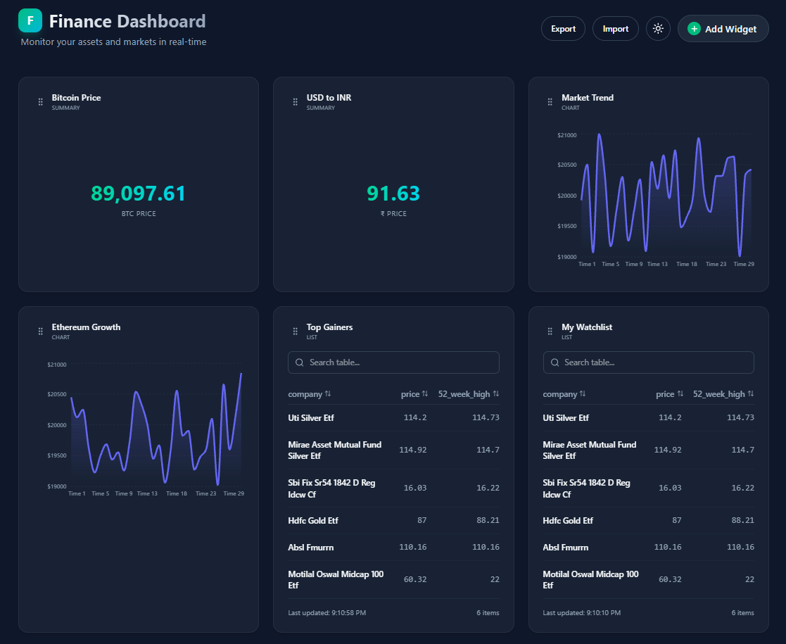

# Finboard - Advanced Financial Dashboard

Finboard is a modern, high-performance financial dashboard application built with Next.js 15. It allows users to track real-time market data, cryptocurrency prices, and financial trends through a fully customizable, drag-and-drop interface.



## 🚀 Features

### 1. **Dynamic Widget System**
- **Drag & Drop Layout**: Arrange your dashboard exactly how you want it using `@dnd-kit`.
- **Multiple Widget Types**:
  - **Summary Cards**: Display distinct values like current Stock/Crypto prices (e.g., BTC, ETH).
  - **Interactive Charts**: Visualize trends over time with `Recharts`. Support for full-screen mode for detailed analysis.
  - **Data Lists**: tabular data views for watchlists or market gainers.
- **Full Screen Mode**: Expand any widget to focus on the details without distractions.

### 2. **Real-Time Data Integration**
- **Universal API Proxy**: Built-in secure API proxy (`/api/proxy`) to fetch data from any external API (Coinbase, CoinGecko, etc.) avoiding CORS issues.
- **Auto-Refresh**: Configure individual refresh intervals for each widget to keep data live.
- **Custom Data Mapping**: Powerful dot-notation support (e.g., `data.rates.USD`) to extract exactly the data point you need from complex JSON responses.

### 3. **Customization & State Management**
- **Persisted State**: Your dashboard layout and widget configurations are saved automatically using `Zustand` (local storage), so you never lose your setup.
- **Edit Mode**: limitlessly configure widget titles, symbols, API endpoints, and data formatting (Currency, Percentage, Numbers).
- **Glassmorphism Design**: top-tier UI with modern glass-card aesthetics, dark mode, and smooth animations.

---

## 🛠️ Technology Stack

- **Framework**: [Next.js 15](https://nextjs.org/) (App Router)
- **Language**: [TypeScript](https://www.typescriptlang.org/)
- **Styling**: [Tailwind CSS](https://tailwindcss.com/) + CSS Modules
- **State Management**: [Zustand](https://github.com/pmndrs/zustand)
- **Drag & Drop**: [dnd-kit](https://dndkit.com/)
- **Charts**: [Recharts](https://recharts.org/)
- **Icons**: [Lucide React](https://lucide.dev/)

---

## 📂 Project Structure

```
.
├── app/                    # Next.js App Router pages
│   ├── api/proxy/          # Internal API proxy for external requests
│   ├── layout.tsx          # Root layout with global styles
│   └── page.tsx            # Main dashboard entry point
├── components/
│   └── dashboard/          # Core dashboard components
│       ├── widgets/        # Individual widget components (Chart, Summary, etc.)
│       ├── AddWidgetModal  # Modal to create new widgets
│       ├── EditWidgetModal # Modal to configure existing widgets
│       ├── WidgetCard      # Wrapper component handling DnD and standard actions
│       └── Dashboard       # Main grid container
├── lib/
│   ├── api.ts              # Fetch utilities
│   └── utils.ts            # Class merging helpers (cn)
├── store/
│   └── useDashboardStore.ts # Global state definition (Zustand)
└── public/                 # Static assets
```

---

## ⚡ Getting Started

### Prerequisites
- Node.js 18+ installed.

### Installation

1. **Clone the repository** (or download source):
   ```bash
   git clone https://github.com/Git-punit/Finance-Dashboard.git
   cd finboard-app
   ```

2. **Install Dependencies**:
   ```bash
   npm install
   ```

3. **Run Development Server**:
   ```bash
   npm run dev
   ```

4. **Open in Browser**:
   Visit [http://localhost:3000](http://localhost:3000) to see your dashboard.

5. **Demo**:
   Visit [https://finance-dashboard-sand-ten.vercel.app/](https://finance-dashboard-sand-ten.vercel.app/)

---

## 📖 Usage Guide

### Adding a New Widget
1. Click the **"+ Add Widget"** button in the top right.
2. Select text, chart, or list type.
3. Provide a Title and Symbol (e.g., "Google Stock", "GOOGL").
4. (Advanced) Enter an API Endpoint URL to fetch real data.

### configuring APIs (Example)
To track Bitcoin Price using Coinbase API:
1. **Edit** a widget.
2. **Endpoint**: `https://api.coinbase.com/v2/exchange-rates?currency=BTC`
3. **Data Key**: `data.rates.USD`
4. **Format**: `Currency USD`
5. Save changes. The widget will now auto-update with the live price.

### Rearranging Widgets
- Simply click and hold the **Grip Icon** (dots) on any widget header and drag it to a new position. The layout saves automatically.

### Full Screen View
- Click the **Expand Icon** (arrows) on any widget to view it in full screen. This is particularly useful for analyzing long-term charts.

---

## 🤝 Contributing
Feel free to open issues or submit pull requests if you have ideas for new widget types or integrations!


